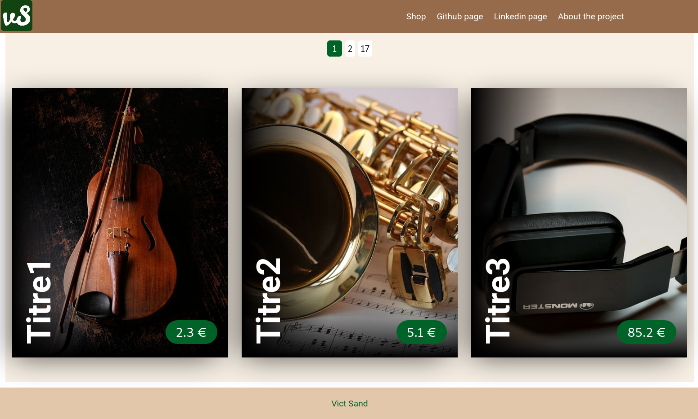

# Basic Eshop

## Project description :
### Goal:
I haven't used Vuejs for one year. Then the goal of this project was to maintain a minimum of ease with this technologie.
### Description;
This project is a small, old fashioned e-shop, build with VueJs 3 and pur SCSS for the Frontend.


[You can check other screenshots and gifs here!](./readme/images)

### Technologies used :
#### Frontend :
I used *Vue3 and Pinia* instead of Vuex to build the Frontend part. At the begining of the project, because Vuetify 3 wasn't realeased, I used *Ant-Design-Vue* for the rendering. I finally ended-up with pur CSS for two reasons :
  - Ant Design was a bit heavy styling solution for this kind of project.
  - I thought that there was a good opportunity to review CSS fundamentals that has evolved since I first learned it.
#### Backend :
At first I used a free online API to fetch products but there wasn't paging mechanism. As a consequence I created a very small API with *Spring-Boot, H2 database and HATEOAS* to fetch products. The offset-based paging mechanism is basic. Then querys might become slow if there are to much products stored in the database.

## How to run the project

  - Run the backend server as [explained here](./products/README.md)

  - :warning: You have to replace `VUE_APP_PRODUCTS_API_BASE_URL` value in [this file](./eshop/.env) with the URL of the backend API (for example: `localhost:8081/products`) in order to link frontend with backend 
  
  ```javascript
  VUE_APP_PRODUCTS_API_BASE_URL='http://192.168.1.25:8081/products'
  ```

  - Then run the front end server as [explaiend here](./eshop/README.md)

## Features implemented : 
### Backend
  - API with only one URL to fetch all products from database 
  - A basic paging mechanism to optimize a bit the frontend
### Frontend
  - A store view to see products
  - A cart using *Pinia* to store a list of product.
  - Loading component printed while the app fetch data from backend server
  - An error if backend server do not respond to the request
  - A navigation menu to navigate in the app with *vue-router*
  - A responsive rendering of the App using *CSS*
  - Some small animation using CSS to make the app a bit more dynamic
## Features to implement :
### Frontend :
  - caching management & optimize prod bundle size
  - refractor code with typescript
  - tests
  - About (me or project)? page
  - betteren the SCSS with DRY principle or use vuetify3 when aviable
  - maybe homepage with cavenas

### Backend : 
  - 404 error (with haetos that give link to /products)
  - CRUD methods ? (might need my authentication sever)
  - more optimized way to do pagination than the based-offset one
  - mabe add a filter with categories
  - test for servlets
  - remove h2 console

## Want to improve the code ?

You see an issue or you want to improve my code ? Then you are welcome to contact me :smile:


## License & copyrights

This project is aviable under the [MIT License](./readme/license)